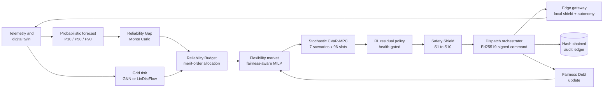
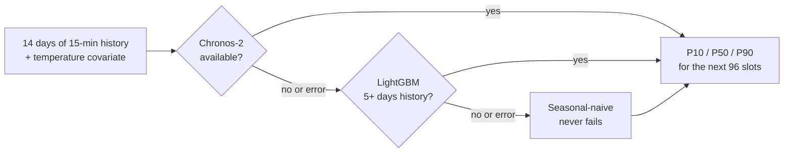
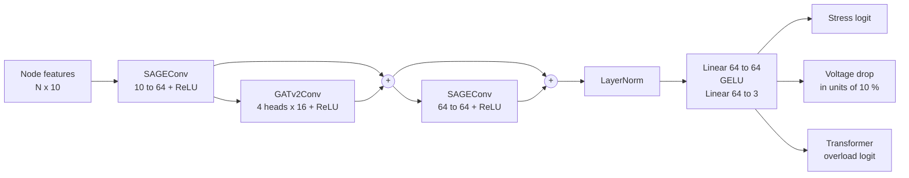
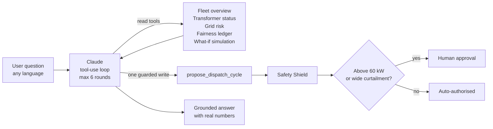
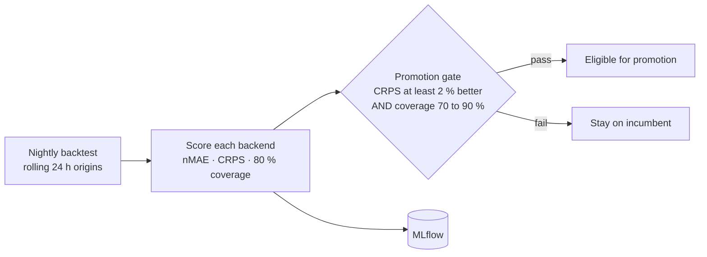
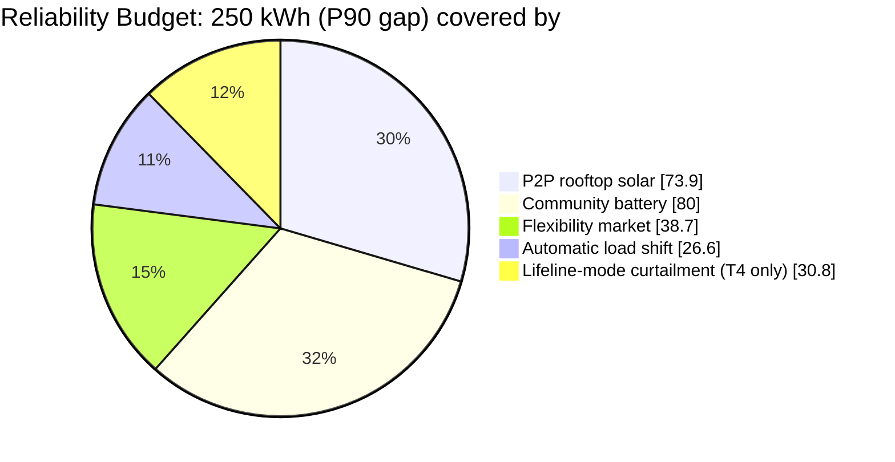
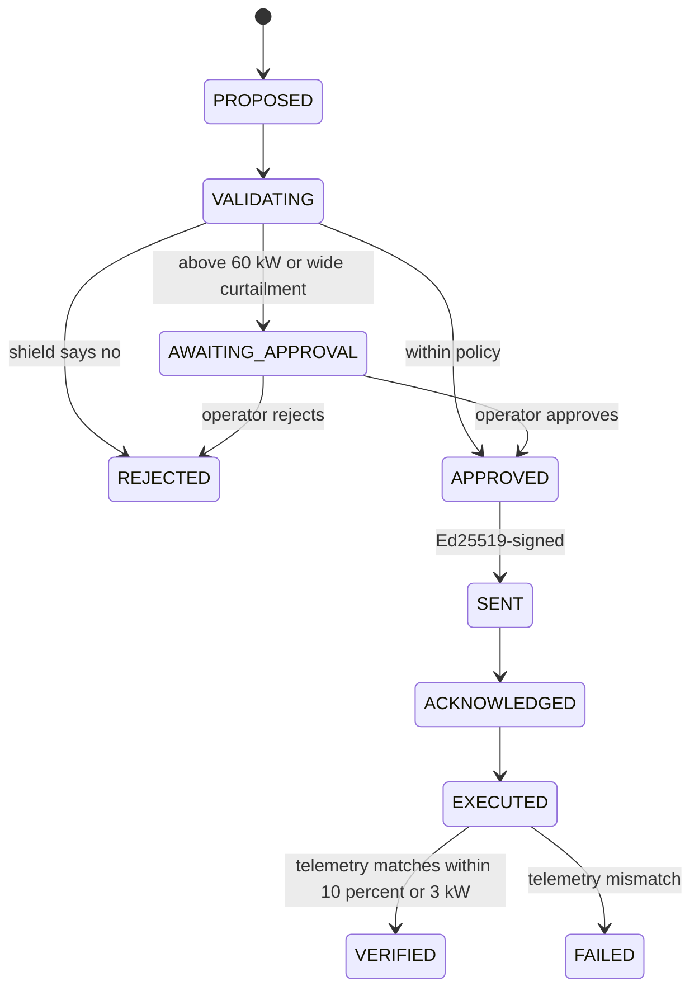

<div align="center">


### ज्योतिवेद · *The reliability operating system for every distribution transformer*

**When clouds cut solar and the grid caps supply, JyotiVeda decides who gets how much power, safely, fairly and explainably, instead of switching whole neighbourhoods off.**

<br/>


<br/>

[**The problem**](#-the-problem) ·
[**The idea**](#-the-idea-reliability-as-a-budget) ·
[**Results**](#-results-at-a-glance) ·
[**Architecture**](#-architecture) ·
[**🧠 AI / ML / DL deep dive**](#-ai--ml--dl-deep-dive) ·
[**Safety**](#-safety-and-trust-layer) ·
[**Run it**](#-quick-start) ·
[**Honest status**](#-honest-status)

</div>

---

## 🚨 The problem

Indian low-voltage neighbourhoods increasingly depend on **rooftop solar**. The risky hour is the **evening ramp**: clouds have cut solar output, the sun is setting, demand peaks, and the DISCOM caps upstream supply in the same window.

The usual response is **blunt load-shedding**. Whole homes go dark, including their *lifeline* loads (lights, fans, phone charging, medical devices, a household fridge), and the same households tend to carry the burden again and again.

> **JyotiVeda's question:** if electricity is *scarce for a few hours*, can we ration it like a budget, protecting what matters most, using every local resource (solar, battery, flexible loads) and spreading the inconvenience fairly?

---

## 💡 The idea: reliability as a budget

Treat reliability as a **finite budget to allocate**, not a switch to throw.

```text
   FORECAST            BUDGET                 OPTIMISE               PROTECT            LEARN
 ┌───────────┐     ┌──────────────┐      ┌───────────────┐      ┌─────────────┐    ┌─────────────┐
 │ How big   │ ──▶ │ Who covers   │ ──▶  │ 24 h plan     │ ──▶  │ Deterministic│ ──▶│ Fairness    │
 │ is the    │     │ each kWh, in │      │ that survives │      │ safety shield│    │ debt, audit │
 │ gap? (P90)│     │ merit order? │      │ bad scenarios │      │ + signed cmd │    │ trail       │
 └───────────┘     └──────────────┘      └───────────────┘      └─────────────┘    └─────────────┘
```

1. **Forecast** the *Reliability Gap* probabilistically (P10 / P50 / P90).
2. Build a **Reliability Budget** that covers the gap in a fixed merit order: P2P rooftop solar → community battery → fairness-aware flexibility market → automatic load shift → *lifeline-mode curtailment only as a last resort*.
3. Plan with **risk-aware CVaR-MPC** (and an optional learned RL correction). Every proposed action passes a **deterministic Safety Shield**.
4. Dispatch **Ed25519-signed** commands, verify them against telemetry and write everything to a **hash-chained audit ledger**.
5. Track **Fairness Debt** so the same households are not asked to flex every time.

> ### 🔐 Design rule #1
> **AI recommends. Physics and a deterministic safety layer decide.**
> The authority of each layer *decreases* as its uncertainty *increases*. A neural network can never touch a device directly.

---

## 📊 Results at a glance

Counterfactual **digital-twin** experiment on reference site **DT-104 · Hadapsar Gadital**: same physical day, same weather, same demand. The planner sees only *forecasts*; the physics runs on the *actual* day.

| KPI (simulation) | Baseline: rotational load-shedding | **JyotiVeda** |
|---|---:|---:|
| Critical / lifeline outage (home-hours) | 465.0 | **0.0** |
| Household outage (home-hours, SAIDI-style) | 465.0 | **0.0** |
| Lifeline availability in the scarcity window | 42.6 % | **100 %** |
| Energy not served | 338.95 kWh | **16.86 kWh** (−95 %) |
| Homes with uninterrupted lifeline power | 0 / 180 | **180 / 180** |
| Fairness, Gini of served ratio (lower = fairer) | 0.068 | **0.008** |
| Voltage-violation slots | 0 | 0 |

<details>
<summary><b>Scenario definition</b> (click to expand)</summary>

| Parameter | Value |
|---|---|
| Transformer | 250 kVA (237.5 kW usable), 180 connections, 119 kWp rooftop solar |
| Storage | 200 kWh / 100 kW second-life LFP battery, starting at 50 % SoC |
| Weather shock | −60 % solar between 12:00 and 18:30 (monsoon cloud) |
| Upstream supply | Capped at 70 kW from 17:30 to 22:30; half of the cloud shock also reduces feeder supply |
| Forecast error | 8 % persistent demand error (1σ) injected on purpose |
| Baseline | Rotational shedding, no storage, no flexibility, no coordination |
| Reproduce | `jyotiveda simulate` (about 11 s with AC power flow) |

</details>

> ⚠️ **Read this honestly:** these are **simulation results** from a digital twin with synthetic households and weather. They show what the *decision engine* achieves under a modelled scenario. They are not field measurements or real-world guarantees. See [Honest status](#-honest-status).

---

## 🧩 Architecture

### End-to-end control loop (one 15-minute cycle)



| Step | Stage | What happens | Module |
|:--:|---|---|---|
| 1 | **OBSERVE** | Read live twin state (SoC, transformer load, voltage, edge mode) | `runtime/fleet.py` |
| 2 | **PREDICT** | Demand quantiles, physics-informed solar, grid availability, then the Reliability Gap | `forecasting/` |
| 3 | **UNDERSTAND** | Node-level overload and voltage risk for the next 4 h peak | `gridintel/` |
| 4 | **ALLOCATE** | Reliability Budget, then the flexibility market clears household offers | `reliability/`, `flexibility/` |
| 5 | **ORCHESTRATE** | CVaR-MPC plan, optional RL residual, Safety Shield, signed dispatch | `optimization/`, `rl/`, `safety/`, `dispatch/` |
| 6 | **SHARE & LEARN** | Events published, audit chain extended, fairness ledger updated, cached plan pushed to the edge | `audit/`, `fairness/`, `edge/` |

### Control hierarchy: authority decreases with uncertainty

```text
PHYSICAL SAFETY   (relays, BMS protection)             ← never overridden
HARD CONSTRAINTS  (Safety Shield S1–S10, cloud + edge) ← deterministic, property-tested
MPC               (feasible, constraint-satisfying)    ← deterministic given forecasts
RL                (residual proposals, health-gated)   ← learned; bypassed when unhealthy
AI FORECASTS      (probabilistic, calibrated)          ← inputs only
DATA
```

### Resilience: what happens when things fail

| Failure | Behaviour | Where |
|---|---|---|
| Foundation-model forecaster unavailable | LightGBM quantile + conformal, then seasonal-naive. Each fallback is metered. | `forecasting/service.py` |
| GNN checkpoint missing | LinDistFlow physics risk engine takes over | `gridintel/risk.py` |
| RL policy missing or unhealthy (>20 % unsafe proposals) | MPC runs alone | `rl/policy.py` |
| Primary MPC solver fails | Secondary solver, then rule-based edge controller | `optimization/mpc.py`, `edge/gateway.py` |
| Cloud link lost | Edge follows its cached plan, corrected by the live deficit | `edge/gateway.py` |
| Cached plan expires | Edge lifeline controller: battery covers the deficit, homes limited to lifeline loads | `edge/gateway.py` |
| Stale battery telemetry or BMS alarm | Battery forced idle (rules S2, S10) | `safety/shield.py` |
| Command replay or tampering | Rejected by signature verification plus a nonce cache | `security/signing.py` |
| Telemetry does not match the setpoint | Dispatch marked `FAILED` and alerted | `dispatch/orchestrator.py` |

---

## 🧠 AI / ML / DL deep dive

### Status legend

| Badge | Meaning |
|:--:|---|
| 🟢 **LIVE** | Runs in the local demo and is covered by tests |
| 🟡 **BUILT** | Complete code and training pipeline; **no trained weights are shipped**, so the automatic fallback runs in the demo |
| 🔵 **OPTIONAL** | Works once an API key or the `ml` extra is supplied |

We label this per component because judges and operators should always know *which engine produced a number*. The UI's "Model runtime" panel reads the same status from the backend.

### The AI map

| # | Component | Family | Method | Role in the loop | Status |
|:-:|---|---|---|---|:-:|
| 1 | Demand forecaster | **ML** (gradient boosting) | LightGBM quantile regression + split-conformal calibration | P10 / P50 / P90 demand, 24 h ahead | 🟢 |
| 2 | Foundation forecaster | **DL** (transformer) | Amazon Chronos-2, zero-shot with covariates | Day-one forecasts for transformers with little history | 🟡🔵 |
| 3 | Solar forecaster | **Physics + AI weather** | pvlib clear-sky × cloud-transmittance quantiles | P10 / P50 / P90 PV output | 🟢 |
| 4 | Reliability Gap | **Statistical ML** | Monte Carlo with a correlated (copula-style) sampler | Probability and size of shortage, risk windows | 🟢 |
| 5 | Grid risk engine | **Physics** | LinDistFlow voltage-drop + thermal loading | Node-level stress, voltage and overload risk | 🟢 |
| 6 | Grid GNN | **DL** (graph neural net) | GraphSAGE + GATv2 hybrid, trained on pandapower labels | Fast learned surrogate of the risk engine | 🟡 |
| 7 | Planner | **Stochastic optimisation** | Two-stage CVaR-MPC (CVXPY, CLARABEL) | 24 h battery and flexibility schedule | 🟢 |
| 8 | Residual policy | **RL** (constrained PPO) | PPO-Lagrangian, MLP 128×128, ONNX runtime | Learned correction on top of MPC | 🟡 |
| 9 | Flexibility market | **Combinatorial optimisation** | Fairness-aware MILP (HiGHS), uniform-price settlement | Clears household flexibility offers | 🟢 |
| 10 | Fairness Debt | **Algorithmic fairness** | Decaying, income-weighted burden ledger | Keeps burden from piling on the same homes | 🟢 |
| 11 | Online bias correction | **Adaptive learning** | Rolling forecast-ratio correction | Re-centres the forecast during the day | 🟢 |
| 12 | Explainability | **XAI** | Decision drivers + MPC shadow prices + twin counterfactuals | "Why did the AI do this?" | 🟢 |
| 13 | Jyoti Copilot | **LLM agent** | Claude tool-use agent with 6 live tools and 1 guarded write | Natural-language operations in Hindi, Marathi, English and more | 🔵 |
| 14 | MLOps | **ML lifecycle** | Nightly backtest, CRPS + coverage promotion gate, MLflow | Decides which model is allowed in production | 🟢 |

---

### 1 · Probabilistic demand forecasting &nbsp;🟢 LightGBM · 🟡🔵 Chronos-2

**Why probabilistic?** A single "expected demand" number hides the risk. The reliability question is *"how bad could the evening be?"*, so every forecast is a **P10 / P50 / P90 band**, and the planner reasons over the band.

**A three-tier backend chain.** Each backend returns the same `QuantileForecast` contract. The service tries them in order and **never blocks the control loop**.



| Tier | Model | Type | Why it exists |
|---|---|---|---|
| 1 | **Amazon Chronos-2** | Pretrained time-series *foundation model* (transformer), zero-shot, past + future covariates | Useful on a **brand-new transformer with only days of history**, and no site-specific training needed. Weights can be mirrored from S3/MinIO for air-gapped DISCOM networks. |
| 2 | **LightGBM quantile + conformal** | Gradient-boosted trees, one model per quantile | Strong, fast, CPU-only **benchmark that every foundation model must beat**. This is what runs in the demo. |
| 3 | **Seasonal-naive** | Empirical same-slot median and spread over the last 7 days | Always available, so a forecast always exists. |

#### How the LightGBM forecaster works (the live one)

- **Features:** `sin`/`cos` of time-of-day (so 23:45 and 00:00 are neighbours), day-of-week, the **14-day mean demand profile at that slot**, and weather covariates (temperature) when available.
- **Three models, one per quantile:** objective `quantile` with α ∈ {0.1, 0.5, 0.9}, 200 boosting rounds, learning rate 0.05, 31 leaves. The quantile (*pinball*) loss is
  $$\mathcal{L}_\alpha(y,\hat q)=\max\big(\alpha\,(y-\hat q),\ (\alpha-1)(y-\hat q)\big)$$
- **Quantile-crossing fix:** independently trained heads can output P10 > P50. We sort across the quantile axis so the band is always monotone.
- **Split-conformal calibration (CQR):** the last 2 days are held out. We measure how far actual demand falls *outside* the raw [P10, P90] band and **widen the band by that conformity quantile**:
  $$s_i=\max\big(\hat q_{0.1,i}-y_i,\ y_i-\hat q_{0.9,i}\big),\qquad \hat q_{\text{conf}}=\mathrm{Quantile}_{\lceil (n+1)\cdot 0.8\rceil / n}(s)$$
  $$\text{final band}=\big[\hat q_{0.1}-\hat q_{\text{conf}},\ \hat q_{0.9}+\hat q_{\text{conf}}\big]$$
  The widening in kW is returned in the forecast metadata, so the UI can show how much extra caution calibration added.

#### Measured on the digital twin (CPU, 7-day rolling backtest)

| Model | nMAE | CRPS (approx.) | 80 % band coverage | Passes promotion gate? |
|---|---:|---:|---:|:-:|
| Seasonal-naive | 4.37 % | 2.10 | 100 % (over-wide) | baseline |
| **LightGBM + conformal** | **1.41 %** | **0.84** (−60 %) | 76 % | ✅ |

> The demand history and the "actual" day both come from the twin's synthetic household generator, so absolute errors are optimistic compared with real smart-meter data. The point is the *pipeline*: calibrated bands, backtests, and a gate that decides what gets promoted.

---

### 2 · Physics-informed solar forecasting &nbsp;🟢

Rooftop PV is not forecast from scratch. We use **physics for the sun and AI only for the clouds**:

$$P_{\text{PV}}(t)=\underbrace{P_{\text{clear-sky}}(t)}_{\text{pvlib Ineichen model}}\ \times\ \underbrace{\tau_{\text{cloud}}(t)}_{\text{weather-AI transmittance}\ \in[0,1]}$$

- The cloud transmittance forecast comes with an uncertainty σ. The **P10 / P50 / P90** are `clear-sky × clip(τ ∓ 1.2816·σ)`.
- A production weather provider (`OpenMeteoProvider`) converts cloud cover to transmittance with a **Kasten–Czeplak attenuation** curve, `τ = 1 − 0.75·cc^3.4`. The code is structured so that AI weather models (GraphCast-class, Aurora, Earth-2) or INSAT cloud nowcasts drop in behind the same `WeatherProvider` interface.
- In the demo, the twin supplies a *synthetic* cloud forecast: the smoothed true cloud series plus a persistent error.

**Why this design:** the sun's geometry is known exactly, so there is no reason to make a network learn it. Physics gives the right shape, and the learned part only has to predict the one thing that is actually uncertain.

---

### 3 · Reliability Gap: Monte Carlo with correlated errors &nbsp;🟢

> **Reliability Gap** = demand − solar − available grid supply (− battery). A positive gap means somebody goes without power unless we act.

Demand and solar errors are **not independent**: a cloudy, humid evening is *both* low-solar and high-demand (fans, coolers). Treating them as independent would under-estimate the tail risk.

1. Draw 400 paired samples with correlation **ρ = −0.6**: `z₂ = ρ·z₁ + √(1−ρ²)·ε`.
2. Convert each z-score into a demand and a solar trajectory with an **inverse-CDF sampler** fitted to the forecast's P10 / P50 / P90 (a split-normal with separate lower and upper σ, so skewed bands stay skewed).
3. Each sample's error is **persistent through the day**, because a bad forecast day stays bad.
4. Per slot, compute `gap = max(demand − solar − grid_cap − battery, 0)` and summarise.

**Outputs:** per-slot **P(shortage)**, expected and P90 shortage kW, total **expected and P90 kWh**, and **risk windows** (contiguous slots where P ≥ 30 %).

**Example (DT-104 reference day):** one evening window, 17:45 → 22:15, with P(shortage) = 100 %, about **202 kWh expected** and about **249 kWh at P90**. The P90 figure is what sizes the Reliability Budget.

---

### 4 · Graph neural network for grid risk &nbsp;🟡 BUILT · 🟢 physics teacher runs live

**What it does.** Predicts, for every node in a transformer's low-voltage network, *"how likely is this node to be stressed?"*, covering under-voltage, line stress and transformer overload. It is a **learned surrogate** of the physics engine: once trained, it scores a neighbourhood in one forward pass instead of running a power-flow solve, and it can in principle be fine-tuned on field outcomes the physics model cannot see.

#### Why a *graph* network?

A distribution feeder is literally a graph (transformer → laterals → buses → households). Voltage at a house depends on the load of everything *upstream and beside* it on the same lateral, which is exactly what message passing captures. A plain MLP would see each house in isolation.

#### The graph

```text
 DT (transformer) ── B1 ── B2 ── B3 … B10      ← lateral 1  (30 LV buses over 3 laterals)
        ├────────── B11 ─ B12 … B20            ← lateral 2
        └────────── B21 ─ B22 … B30            ← lateral 3
                     │     │
                    🏠🏠  🏠            households hang off their LV bus (service drops)
```

Built by `gridintel/graph.py`, with undirected edges carrying line resistance and reactance. Each node gets **10 features**:

| Index | Feature | Notes |
|:-:|---|---|
| 0–2 | Node kind (one-hot) | transformer / bus / household |
| 3 | **Demand** (kW), set to the **P90 case** at inference | households, then aggregated up to buses and the DT |
| 4 | **Solar** (kW), set to the **P10 (pessimistic) case** at inference | aggregated the same way |
| 5 | Transformer rating | DT node only |
| 6 | Electrical distance to the DT (Ω) | position along the lateral |
| 7 | **Protected (T0+T1) load** (kW) | lifeline and life-critical demand |
| 8 | Nearby battery discharge capacity (kW) | DT node |
| 9 | Loading ratio | demand ÷ rating |

> **Forecast → risk coupling:** the graph is built at the **forecast peak slot**, with demand scaled to its **P90/P50 ratio** and solar scaled to its **P10/P50 ratio**. So the risk engine stress-tests the grid at *pessimistic* conditions, not average ones.

#### The model: `GridRiskGNN` (`gridintel/gnn.py`)



- **GraphSAGE** layers aggregate each node's neighbourhood (mean aggregation) and scale to large graphs.
- **GATv2** adds *learned attention* over neighbours, so the model can decide that the next bus upstream matters more than a neighbouring house. Four heads of width 16 are concatenated back to 64.
- **Residual connections + LayerNorm** keep training stable across depth.
- **Three heads** share one trunk: node stress (classification), voltage drop (regression), transformer overload (classification).

#### Training recipe (`ml/train_gnn.py`)

| Item | Setting |
|---|---|
| **Teacher / labels** | **pandapower AC power flow** on randomised neighbourhoods (80–260 connections, 0–60 % solar share, random loading and time of day) |
| Labels per node | `stress` = voltage < 0.955 p.u. · `voltage drop` = (1 − V)×10 · `overload` = transformer loading > 100 % |
| Dataset | 20,000 snapshots by default, 90 / 10 train / validation split |
| Loss | `BCE(stress, pos_weight=5)` + `MSE(voltage drop)` + `0.2 × BCE(overload)`. The 5× positive weight is deliberate: **missing a stressed node is worse than a false alarm.** |
| Optimiser | AdamW, lr 2e-3, weight decay 1e-4, 40 epochs, batch 32 |
| Metrics | precision, recall and **missed-stressed-node rate (1 − recall)**, logged to MLflow |

```bash
uv run --extra ml python ml/train_gnn.py --snapshots 20000 --out models/gnn_risk.pt
export JYOTIVEDA_GNN_CHECKPOINT=models/gnn_risk.pt     # engine switches to "gnn-graphsage"
```

#### The physics engine that runs today (and teaches the GNN)

`PhysicsRiskEngine` implements **LinDistFlow**, the linearised distribution power-flow model, along each lateral:

$$\Delta V_k \approx \sum_{\text{lines upstream of }k}\frac{R\,P_{\downarrow}+X\,Q_{\downarrow}}{V^2},\qquad Q=P\tan\varphi\ (\text{pf}=0.95)$$

Risk is then squashed into `[0, 1]` with calibrated sigmoids and combined so that *any* failure mode raises the alarm:

$$\text{overload}=\sigma\big(12\,(\text{loading}-0.9)\big),\qquad \text{voltage}=\sigma\big(150\,(0.955-V_{\min})\big)$$
$$\text{transformer risk}=1-(1-\text{overload})(1-\text{voltage})\big(1-\min(2\cdot\text{scarcity},1)\big)$$

Levels: **LOW** < 0.25 ≤ **MODERATE** < 0.5 ≤ **HIGH** < 0.75 ≤ **CRITICAL**.

**Why we ship both.** Physics is deterministic, explainable and always available, so it is the fallback and the teacher. The GNN is the scale-out and learning path. Both return the same `RiskReport`, and switching is one environment variable. The status strip in the UI shows which one is active.

> **Status:** architecture, graph builder, loss and training pipeline are implemented; **no trained checkpoint is committed**, so the demo reports `engine: physics-lindistflow`.

---

### 5 · Two-stage stochastic CVaR-MPC &nbsp;🟢

**What it does.** Produces the next-24-hour plan for the community battery and flexible loads that is **robust to bad forecasts**, solved as one convex program (a linear program, in CVXPY with the CLARABEL solver and HiGHS as a secondary solver). The repo documents about 0.13 s for 96 slots × 7 scenarios on CPU.

**Scenarios:** 7 equally likely forecast scenarios taken from the inverse normal at quantiles `(i+½)/7`, i.e. z ≈ −1.47 … +1.47. Demand scenario *s* is paired with solar scenario *−s*, so **the worst demand always meets the worst solar**. This is a deliberately conservative coupling.

| | Decisions | Shared across scenarios? |
|---|---|:-:|
| **Stage 1** (here-and-now) | battery charge `c`, discharge `d`, SoC, flexible-load shift-out `o` and shift-in `n` | ✅ non-anticipative |
| **Stage 2** (recourse, per scenario) | grid import `g`, solar curtailment `k`, unserved energy by tier `u₀`, `u₂`, `u₃` | ❌ adapts to each scenario |

**Objective (₹):**

$$\min\ \underbrace{\mathbb{E}_s\Big[\sum_t \big(V_0 u^0_{s,t}+V_2 u^2_{s,t}+V_3 u^3_{s,t}+\text{tariff}_t\,g_{s,t}\big)\Delta t\Big]}_{\text{expected cost incl. value of lost load}}
+\underbrace{\sum_t\big(\text{deg}\cdot(c_t+d_t)+\text{flex}\cdot o_t\big)\Delta t}_{\text{battery wear + flexibility cost}}
+\ \beta\cdot\underbrace{\mathrm{CVaR}_{0.9}\Big(\sum_t u^0_{s,t}\Delta t\Big)}_{\text{tail risk on protected loads}}$$

The objective also carries a small solar-curtailment penalty and a terminal-SoC value, so the battery doesn't end the day empty for no reason.

- **Tiered value of lost load (VoLL):** ₹500/kWh for protected loads (T0 life-critical + T1 lifeline), ₹120 for livelihood loads (T2), ₹20 for flexible and discretionary loads (T3/T4). This is how the optimiser "knows" a medical device matters more than an air-conditioner.
- **CVaR (Rockafellar–Uryasev linearisation):** instead of only minimising the *average* protected-load loss, we also minimise the **average of the worst 10 % of scenarios**, so the plan protects against the bad days, not just the typical one.
- **Constraints:** per-scenario energy balance · SoC dynamics with charge and discharge efficiency · SoC limits and power limits · grid import ≤ min(supply cap, transformer rating) · **rebound constraints** (energy shifted out of the evening must be consumed *later*, and causally: `cumsum(n) ≤ cumsum(o)`).
- **Shadow prices:** the dual values of the energy-balance constraints give the **marginal ₹ value of one more kWh at each moment**. They feed the explainability layer (see §12).
- **Receding horizon:** in the closed-loop simulation the plan is recomputed every 8 slots (2 h).

---

### 6 · Constrained reinforcement learning (PPO-Lagrangian) &nbsp;🟡

**Role.** MPC is optimal *given its forecasts*. A learned policy can pick up systematic patterns the model misses (forecast-error structure, rebound behaviour) and propose a small **residual correction** on top of the MPC battery setpoint. It is an *optional enhancer*, never a dependency.

| | |
|---|---|
| **Environment** | `DTFlexEnv` (Gymnasium) wrapping the digital twin, domain-randomised every episode: solar cut 0–90 %, heat 0.9–1.3×, random seed, initial SoC 20–90 % |
| **Observation (13-D)** | sin/cos time of day · battery SoC · protected kW · other kW · solar kW · grid cap · P(shortage) in the next 1 h and 4 h · flexible kW · tariff · MPC battery hint · fairness mean (reserved) |
| **Action (2-D, in [−1, 1])** | ① residual on the battery setpoint, up to ±30 % of rating ② share of flexible load to activate |
| **Reward** | −(500·protected-unserved + 20·other-unserved + tariff·grid + 1.8·\|battery\| + 4·shifted) · Δt / 100 |
| **Safety cost** | protected-load shortfall (kWh) + a penalty for sitting near the SoC floor |
| **Algorithm** | PPO (Stable-Baselines3), MLP actor-critic 128×128, 8 parallel environments, γ = 0.995, GAE λ = 0.95 |

**Why "Lagrangian"?** We want to maximise reward *subject to a safety budget*, not trade the two off by hand. The reward is penalised by a multiplier `λ`, and `λ` is adjusted by **dual ascent** after every rollout:

$$r'_t=r_t-\lambda\,c_t,\qquad \lambda\leftarrow\max\big(0,\ \lambda+\eta\,(J_c-d)\big)$$

where `J_c` is the episode's protected-load shortfall, `d = 0.05 kWh` is the allowed budget and `η = 0.05`. If the policy is unsafe, `λ` grows until safety is learned, so the policy tends to respect constraints *before* the shield has to step in.

**Three layers of containment at runtime:**

1. **Bounded authority:** the residual is capped at 30 % of battery rating.
2. **Shield after policy:** the blended setpoint passes the Safety Shield like any other proposal.
3. **Health gate:** the policy keeps a rolling window of its last 200 proposals. If more than **20 %** needed shield correction, it is **automatically bypassed** and MPC runs alone (the response then reports `healthy: false`).

**Deployment:** the actor's mean action is exported to **ONNX** and run on CPU with `onnxruntime`. The intended promotion criterion is to beat MPC-only on held-out scenarios *with zero increase in shield interventions*.

```bash
uv run --extra ml python ml/train_ppo.py --steps 500000 --out models/ppo_residual.onnx
export JYOTIVEDA_RL_POLICY_ONNX=models/ppo_residual.onnx
```

> **Status:** environment, Lagrangian training loop, ONNX export, runtime blending and health gating are implemented. **No trained policy is committed**, so the demo reports `policy: mpc-only`, which is exactly the safe fallback.

---

### 7 · Fairness-aware flexibility market + Fairness Debt &nbsp;🟢

**The market.** Households post offers to defer flexible loads (EV charging, water pump, geyser, washing, AC, commercial refrigeration). A **mixed-integer linear program** (HiGHS) picks the cheapest set that covers the kWh the budget needs:

$$\min_x\ \sum_i x_i E_i\big(p_i+\kappa_{\text{asset}(i)}+\lambda\cdot\text{debt}_{h(i)}\big)\quad\text{s.t.}\quad \sum_i x_iE_i\ge\text{need},\ \ \sum_{i\in h}x_i\le1,\ \ x_i\in\{0,1\}\text{ or }[0,1]$$

- `p_i` is the household's own price, `κ` a **discomfort premium** by asset (pump ₹0 … refrigeration ₹6 per kWh), and **`λ·debt` the fairness penalty**, which makes recently burdened homes more expensive to pick.
- Indivisible assets (an EV session) are binary; divisible ones (pump runtime) are continuous.
- **Uniform-price settlement:** every accepted kWh is paid the marginal accepted price, so bidding your true cost is optimal (incentive-compatible). A DISCOM price cap (₹15/kWh) bounds the cost.

**Fairness Debt: a ledger of who has carried the burden:**

$$\text{debt}_{t+1}=\max\Big(\gamma\,\text{debt}_t+w_{\text{income}}\cdot\frac{\text{burden}_t}{\text{baseline}_t}-\overline{\text{share}},\ 0\Big)$$

- `burden` = shifted kWh × inconvenience + curtailed kWh × 2.5.
- Dividing by the household's **own baseline consumption** means a small home isn't asked for the same absolute kWh as a large shop.
- `w_income` = 1.5 for low-income, 1.0 for middle-income, 0.8 for commercial: the same kWh hurts more where margins are thin.
- Subtracting the population-mean share keeps the ledger roughly zero-sum, and `γ = 0.97` per 15-min slot makes old burden fade (half-life ≈ 5.7 h).
- Selection and curtailment weights are `1/(1+debt)`: **high debt ⇒ asked less.**
- Published per transformer as **Gini** and **Jain** fairness indices.

---

### 8 · Reliability Budget &nbsp;🟢

Turns the P90 gap into an **auditable allocation** that a DISCOM engineer, an auditor or a resident can read:

| Order | Resource | Unit cost assumed | Note |
|:-:|---|---:|---|
| 1 | P2P rooftop solar | ₹4.0 / kWh | surplus shared within the transformer, stored or shifted |
| 2 | Community battery | degradation + 30 % of peak tariff | priced for wear, ≈ ₹1.8/kWh throughput on DT-104 |
| 3 | Flexibility market | median offer price | cleared by the fairness-aware MILP |
| 4 | Automatic load shift | ₹3.0 / kWh | opt-in smart-plug / smart-meter scheduling of T3 loads |
| 5 | **Lifeline-mode curtailment** | ₹25.0 / kWh | comfort loads limited; **T0/T1 always served**, a *last resort* |
| — | Uncovered | — | reported explicitly if resources run out |

**Load tiers** used everywhere (budget, MPC, shield):
`T0` life-critical (medical, clinic cold chain) · `T1` lifeline (light, fan, phone, fridge, ~150–300 W per home) · `T2` livelihood (sewing machine, shop fridge) · `T3` flexible (pump, geyser, EV, washing) · `T4` discretionary (AC, TV).

---

### 9 · Battery intelligence (physics-based degradation pricing) &nbsp;🟢

The optimiser must know that **1 kWh from a second-life battery is not free**. We price wear with two standard models:

- **Wöhler cycle-life curve (LFP):** `N(DoD) = N₈₀ · (0.8 / DoD)^1.1`. Deeper discharges cost disproportionately more life.
- **Arrhenius temperature factor** (Eₐ = 0.3 eV): hot batteries age faster, so energy is priced higher.

Derating and lock-outs follow manufacturer-style windows: **no charging below 0 °C · no charge and 50 % discharge at 45–55 °C · full lock-out above 55 °C · 50 % power derate when SoH < 60 % · fail-safe idle on stale telemetry or BMS fault.** The result is a `BatteryEnvelope` that both MPC and the shield respect.

---

### 10 · Online forecast bias correction &nbsp;🟢

During the day, the simulation's closed loop compares **actual vs forecast demand** each slot and re-centres the forecast with the mean ratio of the last 4 slots (clipped to 0.8–1.25×) before the next re-plan. If demand runs 10 % hot all afternoon, the evening plan automatically assumes it will stay hot.

---

### 11 · The graceful-degradation ladder

Every learned component sits on a ladder where the bottom rung is always safe and always available:

| Layer | Best case | Fallback 1 | Fallback 2 |
|---|---|---|---|
| Demand forecast | Chronos-2 (foundation model) | LightGBM + conformal | Seasonal-naive |
| Grid risk | GNN surrogate | **LinDistFlow physics** | — |
| Control | MPC + RL residual | **MPC alone** | Edge cached plan → edge lifeline controller |
| Copilot | Claude tool-use agent | **Offline intent router** | — |

Fallback activations (a forecast backend failing, or a GNN or RL model failing to load) are counted in Prometheus as `jyotiveda_fallback_activations_total`, so you can see when the system is running below its best tier.

---

### 12 · Explainable AI: "Why did the AI do this?" &nbsp;🟢

Every decision is explained from **three auditable sources**. There is no black box between the operator and the battery.

| Source | What it tells you | Where it comes from |
|---|---|---|
| **Decision drivers** | Which inputs pushed the decision (shortfall, critical-load exposure, SoC, deficit probability, flexible demand) with a level (LOW / MEDIUM / HIGH) and a normalised contribution | `explain/attribution.py` |
| **Shadow price** | The marginal ₹ value of one more kWh at that moment: *how scarce power really was* | **Dual values of the MPC energy balance** |
| **Counterfactual** | What would have happened *without* this action: shortfall, homes with lifeline power, voltage, fairness impact | Digital-twin replay |

Real output from the reference run (peak-discharge decision, abridged):

```json
{
  "slot": "2026-07-15T19:45:00",
  "decision": "Discharge 17.7 kWh this slot (70.6 kW)",
  "drivers": [
    { "feature": "Predicted supply shortfall",      "value_kw": 87.7, "level": "HIGH", "contribution": 0.454 },
    { "feature": "Critical-load exposure",          "value_kw": 51.1, "level": "HIGH", "contribution": 0.212 },
    { "feature": "Deficit probability (next hour)", "value": 0.978,   "level": "HIGH", "contribution": 0.202 },
    { "feature": "Battery state of charge",         "value": 0.602,   "level": "HIGH", "contribution": 0.125 }
  ],
  "shadow_price_inr_per_kwh": 14.77,
  "expected_outcome": { "critical_outage_avoided": true, "homes_with_lifeline": 180, "voltage_maintained": true },
  "safety": "validated by deterministic safety shield (S1–S10) before execution"
}
```

> **How to read this honestly:** the *contribution* values are a transparent normalised heuristic over the decision's inputs, **not** SHAP or Shapley values. The *shadow price* is exact (an optimisation dual), and the *counterfactual* comes from the physics-based twin. That combination is deliberately more auditable than a post-hoc attribution on a black box.

The simulation also emits a **narrated event timeline**: `NORMAL → RENEWABLE_RISK_DETECTED → RELIABILITY_BUDGET_CREATED → FLEXIBILITY_MARKET_CLEARED → BATTERY_PRECHARGE → CLOUD_EVENT → FLEXIBILITY_DISPATCHED → BATTERY_ACTIVE → LIFELINE_MODE → CRITICAL_LOADS_PROTECTED → RECOVERY`, which the UI scrubs like a video.

---

### 13 · Jyoti Copilot: an LLM agent with tools, not opinions &nbsp;🔵

A conversational operations assistant for **DISCOM engineers, Urja Sakhi community operators and residents**, in the user's own language (Hindi, Marathi, Tamil, English, …).



- **Grounded, not guessing:** the system prompt requires answers to quote concrete tool results (kW, kWh, %, IST times, ₹). The agent reasons over **live platform tools**, never over its own memory of the grid.
- **Six tools:** `get_fleet_overview`, `get_transformer_status`, `get_grid_risk`, `get_fairness`, `run_what_if` (twin simulation with solar cut, supply cap and battery size) and `propose_dispatch_cycle`.
- **One guarded write:** the only action the LLM can take is *proposing* a dispatch. That proposal goes through the Safety Shield and, above the auto-approval envelope, **waits for a human**. The LLM never controls a device.
- **Audience-aware:** for residents it avoids jargon (no "MPC / GNN / PPO") and talks about "your essential power".
- **Never breaks a demo:** with no API key it degrades to a deterministic **offline intent router** (fleet risk, status, what-if, propose dispatch). Every response carries `mode: "llm" | "offline"`, and the UI shows `Jyoti · offline` when relevant.

```bash
export JYOTIVEDA_ANTHROPIC_API_KEY=sk-...        # enables LLM mode
# model is configurable: JYOTIVEDA_LLM_MODEL
```

---

### 14 · MLOps: a model must *earn* its place in production &nbsp;🟢



- `python -m jyotiveda.ml_backtest --days 30` rolls a forecast origin across the last *N* days for every available backend and applies the gate (also shipped as a Kubernetes CronJob).
- The gate requires a model to be **both more accurate and well calibrated**. A model with a tighter band but under-coverage cannot be promoted.
- Training runs for the GNN and PPO policy are tracked in **MLflow** (precision / recall / Lagrange multiplier / episode cost).
- Observability: Prometheus domain metrics such as `critical_protected_ratio`, `shield_violations_total` and fallback counters, with OpenTelemetry traces and alert rules.

---

## 🎬 Worked example: one evening on DT-104

Everything below is **real output** from `jyotiveda simulate` on the reference scenario.

**1 · The forecast says trouble is coming.** At 00:00 the day-ahead forecast flags `P(shortage) = 100 %` for 17:45 → 22:15, with **202 kWh expected** and **250 kWh at P90** to cover. Protected (T0 + T1) loads in that window total **228 kWh**.

**2 · The Reliability Budget allocates the 250 kWh in merit order:**



**3 · The market clears and the day unfolds:**

| Time | Event | What the system did |
|:--:|---|---|
| 00:00 | `FLEXIBILITY_MARKET_CLEARED` | 83 household offers accepted, 38.7 kWh at ₹8.99/kWh |
| 09:30 | `BATTERY_PRECHARGE` | Stored rooftop surplus ahead of the evening gap |
| 12:15 | `CLOUD_EVENT` | Solar down 72 % versus clear sky |
| 17:45 | `FLEXIBILITY_DISPATCHED` | Pumps, EV charging and washing deferred |
| 18:15 | `BATTERY_ACTIVE` | Battery discharges to cover the gap |
| 21:15 | `LIFELINE_MODE` | Comfort loads limited; **lifeline loads protected in every home** |
| 22:00 | `CRITICAL_LOADS_PROTECTED` | All 180 homes kept lifeline power through the window |
| 22:15 | `RECOVERY` | Supply restored; deferred loads resume; battery recovers |

**4 · The baseline** (rotational shedding, no coordination) leaves **465 home-hours** of outage in the same window. JyotiVeda leaves **0**.

---

## 🔒 Safety and trust layer

### Safety Shield: ten deterministic rules

The shield is pure Python with no ML dependency, so **the identical code runs in the cloud and on the edge gateway**. It returns `APPROVED`, `MODIFIED` (clipped to a safe envelope) or `REJECTED`, and it is covered by property-based tests (Hypothesis).

| Rule | Guarantee |
|:-:|---|
| **S1** | Command freshness: expired or future-dated commands are rejected |
| **S2** | Telemetry freshness: stale telemetry forces the battery idle (fail-safe) |
| **S3** | Battery power within temperature- and SoH-derated limits |
| **S4** | SoC stays within [`soc_min`, `soc_max`] for the whole command |
| **S5** | Battery ramp-rate limit |
| **S6** | Transformer loading ≤ 100 % (emergency overload only if explicitly allowed) |
| **S7** | LV voltage within ±6 % after the action |
| **S8** | **Life-critical (T0) and lifeline (T1) loads are never curtailed** |
| **S9** | Bounded blast radius: a maximum share of homes curtailed at once |
| **S10** | Any BMS fault or protection alarm means no battery action |

### From proposal to physical action



- **Signed commands:** Ed25519 signatures with a validity window and a nonce, so replay and tampering are rejected. The **edge re-validates every command** against local physics.
- **Human in the loop:** large or wide-impact actions wait for a DISCOM operator.
- **Tamper-evident audit:** every state change extends a **SHA-256 hash chain**; `GET /api/v1/audit/verify` recomputes it.
- **Edge autonomy:** if the cloud link drops, the gateway moves `CLOUD_COORDINATED → AUTONOMOUS_CACHED_PLAN → AUTONOMOUS_LIFELINE`, and a local operator (Urja Sakhi) can trigger `MANUAL_EMERGENCY`.

---

## 🧪 The digital twin

- A synthetic transformer neighbourhood: households with income band, connection type (residential, shop, clinic, school), lifeline and critical loads, rooftop PV and EVs, laid out on a **radial LV network** (transformer → 3 laterals → buses → households), with an optional **pandapower AC power-flow** check.
- A **reference fleet of 8 transformers** around Pune (DT-101 … DT-108) with different sizes, solar shares, batteries and supply caps.
- A **counterfactual engine**: the same day is simulated twice, *baseline* vs *JyotiVeda*. The planner sees only forecasts while the physics runs on the actual day.
- **What-if scenarios** (solar cut depth, cloud window, supply cap, battery size, flexibility participation, forecast error), exposed via API and the Simulation Lab.

---

## 🖥 The command centre (frontend)

React 19 · TypeScript (strict) · Vite 6 · TanStack Query · Recharts, with live updates over a **WebSocket (CloudEvents)**.

| Screen | What you do there |
|---|---|
| **Overview** | Fleet stress radar, live power-flow diagram (thickness and speed scale with real kW), status strip showing *which engine is active* |
| **Neighbourhood twin** | Schematic topology, household drill-down, move the twin clock, simulate a cloud-link loss |
| **Forecasts & reliability** | P10 / P50 / P90 fan charts, shortage windows, the Reliability Budget |
| **Simulation lab** | Inject the **renewable shock**, scrub the replay, compare baseline vs JyotiVeda, export JSON |
| **Dispatch & safety** | AI proposal → S1–S10 checks → approval → `VERIFIED` timeline |
| **Community & fairness** | Fairness Debt, Gini / Jain gauges, most-burdened households |
| **Ask Jyoti** | Copilot drawer (shows `offline` or `llm` mode honestly) |

**Preview mode** works with no backend: it replays a saved snapshot of real backend output, clearly labelled as a snapshot. All model-changing controls require a live connection. Every operational number on screen is read from a backend response.

A 5-minute live-demo script is in **[DEMO.md](DEMO.md)**.

---

## 🚀 Quick start

**Prerequisites:** Python ≥ 3.11 · Node.js ≥ 20 · `uv` or `pip`

```bash
# 1 · Backend (terminal 1)
cd "jyotiveda backend"
uv venv && uv pip install -e ".[dev]"        # or: python -m venv .venv && .venv/bin/pip install -e ".[dev]"
source .venv/bin/activate
jyotiveda simulate                           # counterfactual KPIs, no server needed
make demo                                    # fresh demo DB, API on http://localhost:8000  (docs at /docs)

# 2 · Frontend (terminal 2)
cd jyotiveda-frontend
npm ci
npm run dev                                  # http://localhost:3000
```

Open **http://localhost:3000** → *Connect backend* → API `http://localhost:8000` → *Connect with local demo login*.

```bash
# Tests
cd "jyotiveda backend" && pytest             # 26 tests
cd jyotiveda-frontend && npm run build       # strict tsc + vite build
```

### Switching on the heavy AI components

```bash
uv pip install -e ".[dev,ml]"                # PyTorch, PyG, Chronos, SB3, ONNX, MLflow

# Train, then point the platform at the artifacts
uv run --extra ml python ml/train_gnn.py --snapshots 20000 --out models/gnn_risk.pt
uv run --extra ml python ml/train_ppo.py --steps 500000   --out models/ppo_residual.onnx

export JYOTIVEDA_GNN_CHECKPOINT=models/gnn_risk.pt
export JYOTIVEDA_RL_POLICY_ONNX=models/ppo_residual.onnx
export JYOTIVEDA_FORECAST_BACKEND=chronos2          # auto | chronos2 | gbm | seasonal
export JYOTIVEDA_ANTHROPIC_API_KEY=...              # Copilot in LLM mode

python -m jyotiveda.ml_backtest --days 30            # forecast backtest + promotion gate
```

### Handy API calls

```bash
TOKEN=$(jyotiveda token --role DISCOM_OPERATOR)
curl -H "Authorization: Bearer $TOKEN" localhost:8000/api/v1/transformers                  # stress radar
curl -H "Authorization: Bearer $TOKEN" "localhost:8000/api/v1/forecast/DT-104?kind=all"    # fan charts
curl -XPOST -H "Authorization: Bearer $TOKEN" localhost:8000/api/v1/reliability/DT-104/cycle   # one control cycle
curl -XPOST -H "Authorization: Bearer $TOKEN" \
  "localhost:8000/api/v1/simulation/scenario/renewable-shock?solar_reduction=0.7"          # cloud attack
```

---

## 🗂 Repository map

```text
jyotiveda/
├── README.md · DEMO.md
├── jyotiveda-frontend/                 React 19 + TypeScript command centre
│   ├── src/  (App, command, loop, components, api, types)
│   └── public/preview-data.json        saved backend snapshot for Preview mode
└── jyotiveda backend/
    ├── src/jyotiveda/
    │   ├── forecasting/   backends.py (Chronos-2 · LightGBM · naive) · service.py (gap Monte Carlo, solar) · metrics.py · weather.py
    │   ├── gridintel/     graph.py · gnn.py (GraphSAGE + GATv2) · risk.py (LinDistFlow + GNN engine)
    │   ├── optimization/  mpc.py                  two-stage CVaR-MPC
    │   ├── rl/            env.py · policy.py      PPO-Lagrangian env + health-gated ONNX policy
    │   ├── reliability/   budget.py               Reliability Budget
    │   ├── flexibility/   market.py               fairness-aware MILP
    │   ├── fairness/      debt.py                 Fairness Debt, Gini, Jain
    │   ├── battery/       model.py                Wöhler + Arrhenius degradation, derating
    │   ├── explain/       attribution.py          drivers · shadow prices · counterfactuals
    │   ├── copilot/       agent.py                Claude tool-use agent + offline router
    │   ├── safety/        shield.py               S1–S10
    │   ├── dispatch/      orchestrator.py         state machine, approval, verification
    │   ├── security/      rbac.py · signing.py    roles, Ed25519
    │   ├── audit/         ledger.py               SHA-256 hash chain
    │   ├── edge/          gateway.py · protocols.py · runner.py
    │   ├── twin/          simulator.py · network.py (pandapower) · profiles.py · neighbourhood.py
    │   ├── runtime/       platform.py (control cycle) · fleet.py
    │   └── api/           FastAPI app, REST + WebSocket
    ├── ml/                train_gnn.py · train_ppo.py · backtest_forecast.py
    ├── tests/             engines · safety shield (property-based) · system
    └── deploy/ infra/ migrations/ docs/   Helm, Terraform, observability, SQL, architecture
```

---

## 🔎 Honest status

We label every component by what is *actually exercised in this repository*, so you can trust the other claims.

| Area | Status |
|---|---|
| **Data** | The grid, households and weather are produced by the **digital twin (synthetic)**. No field data, smart meters, devices or DISCOM systems are connected. |
| **Demand + solar forecasting, Reliability Gap, risk (physics), MPC, market, fairness, shield, dispatch, edge autonomy, audit, API, UI** | 🟢 Implemented, run in the local demo and covered by the 26 backend tests. |
| **GNN risk model** | 🟡 Architecture, graph builder and training pipeline are complete. **No trained checkpoint is committed**; the demo uses the physics engine (`engine: physics-lindistflow`). |
| **PPO-Lagrangian policy** | 🟡 Environment, training loop, ONNX export and health-gated runtime are complete. **No trained policy is committed**; the demo runs `policy: mpc-only`. |
| **Chronos-2 forecaster** | 🟡🔵 Integration code is complete; needs the `ml` extra and model weights. The demo uses LightGBM. |
| **Copilot (LLM)** | 🔵 Needs an Anthropic API key; the demo runs the offline intent router. |
| **Kafka · TimescaleDB · Keycloak/OIDC · Helm · Terraform · CI pipeline** | Present and configured, but **not exercised** in this repository's demo or tests. Development credentials are placeholders. |
| **Runtime state** | Twin clock, edge mode, dispatch queue, audit chain and the live fairness ledger live in memory and reset on restart (`make demo` starts clean). |

### Known limitations we want judges to hear from us

- Results are **scenario outputs**, not field guarantees. Costs of community ownership, maintenance, tariffs and payback are not modelled.
- The live reliability cycle does not yet advance the household Fairness Debt ledger; fairness numbers shown for the simulation come from the simulation's own ledger.
- Role checks exist at route level; transformer-scope enforcement is not yet consistent across all collection routes. Review before any real-data deployment.
- Restarting against a populated SQLite file can hit an audit-chain restore issue; use `make demo` for a clean start.
- Tested in headless Chromium at three viewport sizes; Safari, Firefox and physical phones were not tested.

### Roadmap

- [ ] Train the GNN on a large pandapower snapshot set and publish precision / recall / missed-stressed-node rate against the physics teacher
- [ ] Make the GNN **edge-aware** (feed line resistance and reactance into GATv2 via `edge_dim`; the graph builder already produces them)
- [ ] Feed the live 13-D observation into the RL policy at inference (the cycle currently passes a placeholder vector), train, and benchmark against MPC-only
- [ ] Replace heuristic driver weights with a calibrated attribution method alongside the exact shadow prices
- [ ] Replace the SoH stub with a physics-informed network trained on BMS partial cycles
- [ ] Pilot on real smart-meter and DT-meter data with a DISCOM and an Urja Sakhi operator

---

## 🎯 Why this answers Track 3: Smart Grid Reliability

| Track need | How JyotiVeda responds |
|---|---|
| **Predict reliability risk** | Calibrated P10/P50/P90 forecasts → Reliability Gap probability, kWh and risk windows → node-level grid risk |
| **Integrate renewables and storage** | Physics-informed PV forecast, P2P solar sharing, degradation-aware community battery |
| **Act before the outage** | Day-ahead budget plus a 24 h stochastic plan that is re-optimised every cycle |
| **Safe AI in critical infrastructure** | Deterministic shield, signed commands, human approval, hash-chained audit, health-gated learned components |
| **Resilience when systems fail** | Fallback ladder for every model, edge autonomy during cloud loss |
| **Equity** | Lifeline loads protected in every home; Fairness Debt and income-weighted burden; Gini / Jain reporting |
| **Measurable impact** | SAIDI-style outage home-hours, energy not served, lifeline availability, Gini, all reproducible with one command |

---

## 📖 Glossary

| Term | Meaning |
|---|---|
| **DT** | Distribution transformer: the neighbourhood-scale unit JyotiVeda manages |
| **DISCOM** | Electricity distribution company |
| **Urja Sakhi** | Community energy operator who can act locally (including emergency mode) |
| **P10 / P50 / P90** | 10th / 50th / 90th percentile forecast: optimistic, median, pessimistic |
| **Reliability Gap** | Demand − solar − available supply (− battery); positive means shortage |
| **CVaR** | Conditional Value-at-Risk: the average loss in the worst *x* % of scenarios |
| **MPC** | Model Predictive Control: optimise a plan over a horizon, apply the first step, repeat |
| **VoLL** | Value of Lost Load: ₹ per kWh not served, higher for more critical loads |
| **SoC / SoH** | Battery state of charge / state of health |
| **CRPS** | Continuous Ranked Probability Score: accuracy of a full probabilistic forecast |
| **LinDistFlow** | Linearised power-flow model for radial distribution networks |
| **Gini / Jain** | Inequality / fairness indices over how burden or service is distributed |
| **T0 – T4** | Load criticality tiers, from life-critical to discretionary |

---

<div align="center">

**JyotiVeda · Local power. Shared reliability.**

TEAM: Jia Jadhav, Seher Siddiqui, Armaan Shaikh
</div>

 
