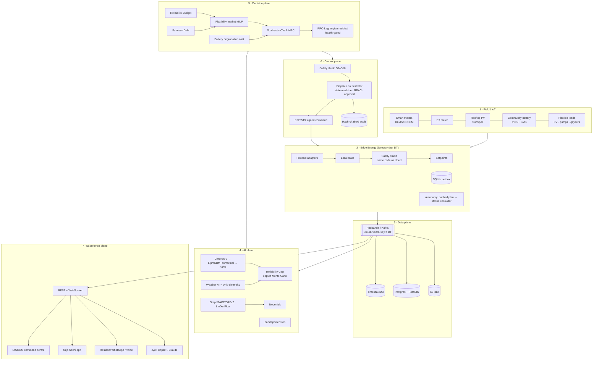

# Jyotiveda architecture

## 1. Seven planes



## 2. Control hierarchy (authority decreases with uncertainty)

```
PHYSICAL SAFETY (relays, BMS protection)       ← never overridden
HARD CONSTRAINTS (shield S1–S10, edge + cloud) ← deterministic, property-tested
MPC (feasible, constraint-satisfying plan)     ← deterministic given forecasts
RL (residual proposals, health-gated)          ← learned; bypassed when unhealthy
AI FORECASTS (probabilistic, calibrated)       ← inputs only
DATA
```

The browser never commands a device. The only path to a device is:
AI → Optimisation → Shield → Orchestrator → RBAC/approval → signed command → edge shield → device → telemetry → verification.

## 3. The 15-minute cycle (`runtime/platform.py::run_cycle`)

1. **Sense**: live twin and edge state (SoC, DT load, voltage).
2. **Predict**: demand quantiles, physics-informed solar and grid availability give the Reliability Gap (probability, expected kWh, P90 kWh and windows).
3. **Understand**: grid-intelligence risk for the next 4 h peak (overload, voltage, critical nodes).
4. **Allocate**: the Reliability Budget follows the merit order. Fairness-weighted MILP clears household offers.
5. **Optimise**: two-stage stochastic MPC over the rest of the day. CVaR on protected-load loss. RL residual.
6. **Protect**: the shield validates. Anything above 60 kW waits for an operator. The signed command goes to the edge, where the shield runs again locally.
7. **Share**: events are published, the audit chain is extended, the fairness ledger is updated and the cached plan is pushed to the edge.

The cycle runs in about 0.1 s per transformer on CPU (MPC with 96 slots × 7 scenarios solves in about 0.13 s).

## 4. Failure handling

| Failure | Behaviour | Where |
|---|---|---|
| Chronos-2 unavailable | LightGBM + conformal, then seasonal-naive; metered fallback | `forecasting/service.py` |
| GNN unavailable | LinDistFlow physics risk | `gridintel/risk.py` |
| RL unhealthy (> 20% unsafe proposals) | MPC only | `rl/policy.py` |
| MPC solver fails | Secondary solver, then rule-based edge controller | `optimization/mpc.py`, `edge/gateway.py` |
| Cloud unreachable | Edge follows the cached plan, corrected by live deficit | `EdgeGateway.tick` |
| Cached plan expired | Edge lifeline controller: battery covers the deficit, homes limited to lifeline | `EdgeGateway._lifeline_controller` |
| Stale battery telemetry | Battery forced idle (S2) | shield |
| BMS alarm | No battery action (S10) | shield |
| Command replay or tamper | Rejected by the Ed25519 verifier plus nonce cache | `security/signing.py` |
| Telemetry ≠ setpoint | Dispatch marked FAILED and alerted | orchestrator |
| Cell pod restart | Edge autonomy covers the gap; the PDB blocks voluntary eviction | Helm |

## 5. Dispatch state machine

```
PROPOSED → VALIDATING ─┬→ REJECTED
                       ├→ AWAITING_APPROVAL → APPROVED | REJECTED | EXPIRED
                       └→ APPROVED → SENT → ACKNOWLEDGED → EXECUTED → VERIFIED | FAILED
```

Every transition is published as an event, counted in Prometheus and appended to the audit chain.

## 6. Event catalogue (Kafka topics = CloudEvent `type`)

`meter.reading` · `transformer.state` · `solar.update` · `battery.update` · `weather.update` · `forecast.created` · `risk.updated` ·
`reliability.budget.created` · `dispatch.{proposed,validated,approved,sent,acknowledged,executed,verified,rejected}` ·
`flexibility.{offered,accepted}` · `fairness.updated` · `alarm.raised` · `simulation.completed` · `edge.heartbeat`

## 7. Security model

- **Identity:** OIDC (Keycloak realm in `deploy/keycloak`), with JWKS verification in prod and HS256 dev tokens in dev.
- **Authorisation:** eight roles (RBAC) plus a transformer-scope claim (ABAC). Postgres row-level security enforces the same scope.
- **Devices:** per-gateway identity. Commands are Ed25519-signed with a validity window and a nonce. The edge re-validates every command against local physics.
- **Data:** India-region hosting, KMS encryption at rest, TLS in transit, and consent artefacts per household (DPDP Act, 2023). The DISCOM sees aggregates at DT level by default.
- **Supply chain:** SBOM, provenance, Trivy gate and cosign keyless signatures. Admission policy verifies signatures.

## 8. Scaling

A **cell** owns up to a few hundred transformers and runs the whole closed loop for them as the single writer.
A DISCOM circle with 10,000 DTs runs about 40 cells. Kafka partitions by DT, and Timescale compresses telemetry after 7 days.
Cells share nothing except the event backbone and the databases, so one cell failing affects only its shard, and edge autonomy covers that shard too.
